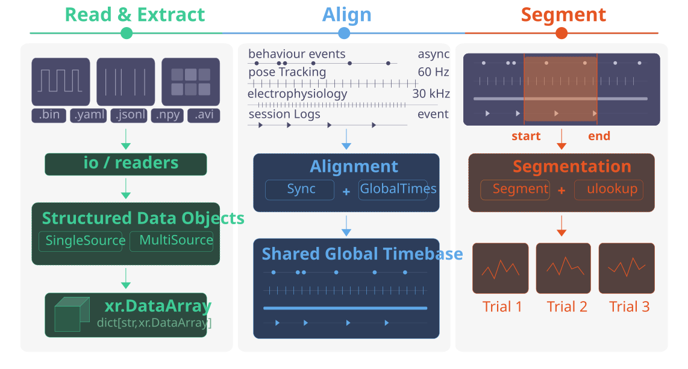

# data-conduit

**A Python Toolkit for Constructing Standardised, Reusable Data Pipelines for Multi-Stream Experimental Data**

<table width="100%"><tr><td align="center" bgcolor="#e07b00"><br>
<h3>🚧 &nbsp; WARNING: THIS LIBRARY IS STILL A WORK IN PROGRESS! &nbsp; 🚧</h3>
This library is under active development - APIs, interfaces, and documentation are subject to change without notice.

Further, many features, particularly documentation, are not finalised, and may only exist as placeholders. As this code is still pre-release,
we do not guarantee that extensive changelogs will be included prior to v1.0
<br><br></td></tr></table>

<table width="100%"><tr><td align="center" bgcolor="#f3f3f3"><br>
&nbsp;
<a href="data_conduit_demo_new.html">📖 User Guide</a>
&nbsp;&nbsp;|&nbsp;&nbsp;
<a href="examples.html">🖼️ Example Gallery</a>
&nbsp;&nbsp;|&nbsp;&nbsp;
<a href="api_index.html">📋 API Reference</a>
&nbsp;&nbsp;|&nbsp;&nbsp;
<a href="CHANGELOG.html">📝 Change Log</a>
&nbsp;&nbsp;|&nbsp;&nbsp;
<a href="ROADMAP.html">🗺️ Roadmap</a>
&nbsp;
<br><br></td></tr></table>

---



---

## What is data-conduit?

`data-conduit` is a Python toolkit for converting outputs from multiple data acquisition sources into consistent, unified data structures that can be used for subsequent analysis.

This library was originally designed for experimental neuroscience labs working with the [Bonsai](https://bonsai-rx.org/) and [HARP](https://harp-tech.org/) ecosystems as part of their workflow, with raw experimental data stored in directories based on the [NeuroBlueprint](https://neuroblueprint.neuroinformatics.dev/) standard. However, most functionalities provided by `data-conduit` are modular and flexible, and should be compatible with other data acquisition platforms, as well as other data conventions. `data-conduit` is concerned with using a consistent structure to automate data processing workflows, rather than enforcing any one particular format.

These workflows are designed to integrate with tools from the broader [neuroinformatics.dev](https://neuroinformatics.dev/) ecosystem, including [datashuttle](https://datashuttle.neuroinformatics.dev/) for data management and [movement](https://movement.neuroinformatics.dev/) for pose tracking analysis.

The functionality of `data-conduit` can be broadly grouped into the following categories:

1. **Automated discovery and reading** of data files from directory trees.
2. **Processing and conversion** of raw data into unified data structures (nested dicts of DataFrames, xarray DataArrays).
3. **Flexible querying utilities** to interact with unified data structures across devices, registers, and data types.
4. **Temporal alignment** of different experimental data streams (e.g. Bonsai/HARP ↔ Neuropixels via TTL synchronisation).
5. **Segmentation** of data using event-based windowing and boolean run-length encoding.

---

## How does data-conduit work?

To explain how `data-conduit` works, it is helpful to first explain how data from HARP devices would normally need to be extracted using the `harp-python` API.

When working with HARP devices, users will find that their experimental data is organised into a hierarchical folder structure, with each device having its own subfolder containing multiple `.bin` files corresponding to different registers. The naming convention follows a consistent pattern: `DeviceName_RegisterAddress_Timestamp.bin`.

A user wanting to access a specific register's data must:
1. Create a device reader from a YAML schema file
2. Know the correct register name and address
3. Construct the correct file path
4. Read the binary data into a DataFrame

**The Problem:**

Whilst these tools provide a basic framework for accessing HARP device data, users will often find themselves working with experiment logs containing multiple devices and multiple registers per device, as well as needing to collate data across sessions, devices, and data types. Using the above approach requires manually repeating these steps for every register of interest across every device and session, which is both a time-consuming and error-prone process.

**The Solution:**

`data-conduit` exploits the one thing that is consistent across all experimental sessions: **the directory structure itself**.

For example, data about a particular component connected to a HARP board will always reside at `[device]/[register]/columns`. By defining a mapping that specifies where each variable of interest is located within the experimental directory — such as by using device, register, and column identifiers — the library can automatically discover, load, and organise all relevant data into consistent structures that mirror the physical layout of the rig.

This means users work with **stable variable names** instead of file paths. The same code works unchanged across sessions, rigs, and experiments, as long as the directory layout is consistent.

---

## Installation

```bash
pip install data-conduit
```

> **Note:** HARP-specific presets (`Device`, `MultiDevice`, etc.) require `harp-python`:
> ```bash
> pip install harp-python
> ```

---

## Package structure

```
data_conduit/
├── io/                  # File discovery and reading
│   ├── io_core.py       # collect_folders, collect_file_paths, collect_dfs
│   └── readers.py       # read_csv, read_harp_bin, read_json, etc.
├── harptools/           # HARP-specific loading (requires harp-python)
│   └── harptools_core.py  # collect_harp_dfs
├── datasources/         # Structured data objects
│   ├── monosource/      # Single-source: dfs_dict → named DataArrays
│   ├── multisource/     # Multi-source: virtual-coord unified DataArrays
│   └── presets/
│       └── harp/        # Device, MultiDevice, SoundCard, Nosepoke, etc.
├── sync/                # Clock synchronisation
│   └── ttl/             # TTL pulse extraction, alignment, and conversion
├── globaltimes/         # Shared global timebase construction
├── virtualarrays/       # DataArray construction and querying (.ulookup)
├── timestamps/          # Timestamp extraction utilities
├── segment/             # Trial segmentation
├── validators/          # Data validation helpers
└── utils/               # Internal selector utilities
```

### How the layers connect

`data-conduit` is organised into three conceptual layers, each building on the one below:

**Layer 1 — IO (functions):** Low-level utilities that discover directories, find files, and read them into DataFrames. These are pure functions with no state.

**Layer 2 — Object layer (classes):** Classes that use the IO layer to load data and then organise it into named outputs. There are two families:
- **MonoSource → Device / FileTypeData**: For cases where each output maps to a single location in the directory tree (one device, one register). Produces a dict of named `xr.DataArray` objects.
- **MultiSource → MultiDevice**: For cases where a single output combines data from *multiple* locations (e.g. nosepoke activations spread across multiple HARP boards). Produces unified DataArrays with virtual coordinate lookup.

**Layer 3 — Alignment & analysis (functions + classes):** Temporal alignment (TTL sync, global clock), segmentation, and querying utilities that operate on the DataArrays produced by Layer 2.

| Layer | Module | Key exports | Purpose |
|---|---|---|---|
| IO | `io` | `collect_folders`, `collect_file_paths`, `collect_dfs` | Walk directories, read files into nested dicts |
| IO | `harptools` | `collect_harp_dfs` | HARP-specific wrapper: collapse, rekey, filter |
| Object | `datasources.monosource` | `MonoSource`, `FileTypeData` | Generic single-source loading → named DataArrays |
| Object | `datasources.presets.harp` | `Device`, `SoundCard`, `Camera0Frames` | HARP device loading + named outputs |
| Object | `datasources.multisource` | `MultiSource` | Virtual-map aligned multi-stream arrays |
| Object | `datasources.presets.harp` | `MultiDevice`, `Nosepoke` | HARP multi-device loading + MultiSource |
| Query | `virtualarrays` | `ulookup`, `.ulookup` accessor | Query DataArrays by virtual coordinates |
| Align | `sync.ttl` | `build_pulse_table`, `extract_ttl_segments`, `get_ttl_timebase_conversion` | TTL pulse alignment between clock domains |
| Align | `globaltimes` | `create_global_clock`, `index_map_util` | Shared timebase + index mapping |
| Segment | `segment` | `get_segment` | Event-based trial windowing |

---

## Workflow

### 1. IO — Discovering and reading files

The IO layer provides the building blocks that every higher-level class uses internally. This is central to much of the rest of the library, as every class in `data-conduit` ultimately calls these functions at some stage.

`collect_dfs` is the engine behind everything else. It walks a directory tree, reads every file it can, and returns a **nested dictionary** that mirrors the folder structure, where each leaf is a DataFrame.

Users control behaviour with two things:
- **`readers`**: a dict mapping file extensions to reader functions (e.g. `{'.csv': read_csv}`)
- **`l{n}_selector`**: level selectors that filter which folders/files are included at each depth

```python
from data_conduit.core.io import collect_dfs
from data_conduit.core.io.readers import read_csv
from data_conduit.core.utils import starts_with

dfs = collect_dfs(
    experiment_directory_path="path/to/experiment",
    readers={'.csv': read_csv},
    l0_selector=starts_with('Behavior'),
)
# Result: {'Behavior0': {'file.csv': DataFrame}, 'Behavior1': ...}
```

Level selectors filter at any depth of the directory tree. They accept:
- **A string**: exact match (`l0_selector='Behavior0'`)
- **A list**: match any item (`l0_selector=['Behavior0', 'Behavior1']`)
- **A callable**: custom logic (`l0_selector=starts_with('Behavior')`)
- **None**: include everything (default)

### 2. The object layer

`collect_dfs` and `collect_harp_dfs` give you nested dicts of DataFrames. Whilst this is already an obvious improvement over manually extracting each data file, users will frequently want other features such as:

1. **Named outputs**: instead of navigating `dfs_dict['Behavior0']['32']`, users would often prefer to use more legible naming such as `soundcard.data_arrays['PlaySoundFreq']`.
2. **Automatic loading**: pass an experiment path and get results, without manually calling IO functions.
3. **Reusable presets**: common device configurations (SoundCard, Camera, Nosepoke) should be one-liners.
4. **Multi-device combination**: when the same data type spans multiple files, users will require a unified DataArray with a shared time axis to view them simultaneously.

#### Device — HARP binary data

`Device` extends `MonoSource` for HARP devices. Presets like `SoundCard`, `CameraStart`, and `Camera0Frames` set sensible defaults so common devices are one-liners:

```python
from data_conduit.integrations.harp.datasource_presets import Device, SoundCard

soundcard = SoundCard(experiment_directory_path="path/to/experiment")
play_freq = soundcard.data_arrays["PlaySoundFreq"]  # xr.DataArray

# Or configure a device manually
device = Device(
    experiment_directory_path="path/to/experiment",
    harp_device_yaml_path="./device.yml",
    device_type="Behavior",
    device_list=["Behavior0"],
    device_registers={"Behavior0": ["32", "34"]},
    device_data_arrays={
        "Activations": {"l0_selector": "Behavior0", "l1_selector": "32"},
    },
)
activations = device.data_arrays["Activations"]  # xr.DataArray
```

#### FileTypeData — CSV, JSON, YAML files

Alongside HARP binary data, Bonsai workflows produce CSV, JSONL, and YAML files for experiment events, video metadata, visual environments, and session settings. `FileTypeData` extends `MonoSource` for these file types and produces `.data_arrays` as the primary interface:

```python
from data_conduit.datasources.monosource import ExperimentEvents, VideoData

events = ExperimentEvents(experiment_directory_path="path/to/experiment")
video  = VideoData(experiment_directory_path="path/to/experiment")
```

#### MultiSource — combining data across multiple sources

`MonoSource` works well when each output maps to a single location in the directory tree. However, users can find themselves with peripherals or other data that spans multiple locations.

Consider a rig with 2 HARP Behavior boards, each with 3 nosepoke ports. The activation data for nosepoke 0 lives at `Behavior0/register_32/DIPort0`, while nosepoke 5 is at `Behavior1/register_32/DIPort2`. To analyse all 6 nosepokes together requires a single DataArray with a merged **Time** dimension, a **peripherals** dimension, and **virtual coordinates** (device, register, localID) attached to each peripheral to allow querying across multiple associated values. This is what `MultiSource` does.

`MultiDevice` combines `collect_harp_dfs` (for loading) with `MultiSource` (for virtual-map construction). `Nosepoke` is a preset subclass with pre-built defaults for a standard 6-board × 3-port layout:

```python
from data_conduit.integrations.harp.datasource_presets import Nosepoke

nosepoke = Nosepoke(experiment_directory_path="path/to/experiment")

# Query by virtual coordinates using the .ulookup accessor
nosepoke.data_arrays["Activations"].ulookup.select(device="Behavior0")
```

### 3. TTL synchronisation and temporal alignment

Bonsai/HARP and Neuropixels run on **independent clocks** that drift over time. To combine behavioural events (HARP timestamps) with neural data (NPX sample indices), a shared time reference is required.

A **TTL square-wave pulse train** is generated and recorded on both systems simultaneously — one copy on a HARP Behavior board (digital IO), one on an NPX sync channel. We extract pulse start/end times from both recordings, fit a linear model mapping NPX time → Bonsai time, and then any NPX timestamp can be converted to Bonsai time (and vice versa).

```python
import numpy as np
from data_conduit.core.sync.ttl import build_pulse_table, extract_ttl_segments, get_ttl_timebase_conversion

# Build Bonsai-side pulse table from HARP digital output events
rise_times = sync_device.data_arrays["DO1_rise"].coords["Time"].values
fall_times = sync_device.data_arrays["DO1_fall"].coords["Time"].values
bonsai_pulses = build_pulse_table(rise_times, fall_times)

# Extract NPX-side pulses from a raw sync channel
npx_raw = np.load("npx_sync.npy")
npx_times = np.arange(len(npx_raw)) / 30000  # 30 kHz
npx_pulses, _ = extract_ttl_segments(times=npx_times, values=npx_raw)

# Align, fit, and optionally visualise
converted_df, ratio, model, fit_stats = get_ttl_timebase_conversion(
    reference_pulses=bonsai_pulses,
    target_pulses=npx_pulses,
    visualisation=True,
    error_visualisation_tools=True,
    return_details=True,
)

# Convert any NPX timestamp to Bonsai time
npx_spike_times_in_bonsai = model.transform(npx_spike_times)
```

`get_ttl_timebase_conversion` aligns both pulse trains, fits a linear model, and optionally visualises the result. Passing `visualisation=True` shows overlaid pulse trains; `error_visualisation_tools=True` adds per-pulse error scatter plots and histograms for verifying sub-millisecond alignment.

#### Global clock and index mapping

`create_global_clock` builds a uniformly-spaced time axis (e.g. at 1-second resolution) that serves as the shared index for all data streams. `index_map_util` then maps any stream's timestamps onto this global axis using nearest-match, giving you aligned indices across all modalities.

```python
from data_conduit.core.globaltimes import create_global_clock, index_map_util

global_clock = create_global_clock(reference_times)
index_map = index_map_util(global_clock, stream_times)
```

### 4. Segment

```python
from data_conduit.core.segment import get_segment

trial_data = get_segment(
    data_array=activations,
    start=trial_start_times,
    end=trial_end_times,
)
# Returns a dict of per-trial xr.DataArrays: {'Trial_1': ..., 'Trial_2': ...}
```

---

## Integration with movement

The `xr.DataArray` outputs produced by data-conduit are directly compatible with [movement](https://movement.neuroinformatics.dev/), a toolkit for pose trajectory and kinematic analysis:

```python
import movement

poses = movement.load_poses.from_file("poses.h5")
trial_poses = get_segment(poses.position, start=trial_starts, end=trial_ends)
speed = movement.kinematics.compute_speed(trial_poses["Trial_1"])
```

---

## Citation

If you use data-conduit in your work, please cite:

> C Marshall, N Sirmpilatze, C Laurent, Q Wu, A Tyson, S Keshavarzi.
> *A Python Framework for Integrated Analysis of Behavioural and Neural Data.*
> *placeholder*

---

## Acknowledgements

Developed at the Keshavarzi Lab, Department of Physiology, Development, and Neuroscience, University of Cambridge, in collaboration with the Neuroinformatics Unit, Sainsbury Wellcome Centre, UCL.
