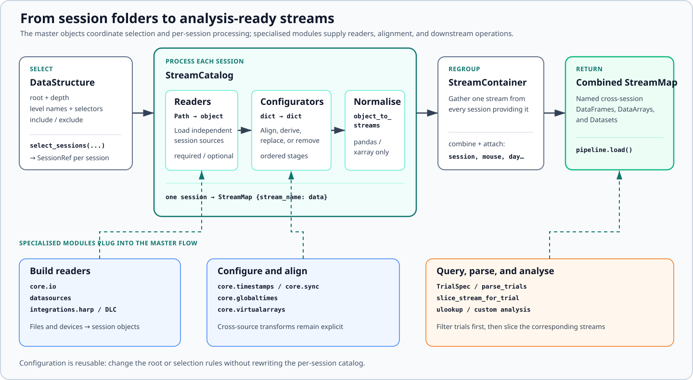

Example Gallery
===============

These focused examples build from file reading to a complete multi-session
workflow. Complete examples use synthetic data or temporary directories and do
not depend on private laboratory datasets. Short adaptation snippets mark the
paths or workflow-specific readers that you need to supply.

Start with the part of the pipeline you need:

.. list-table::
   :header-rows: 1
   :widths: 28 72

   * - Example
     - What it demonstrates
   * - :doc:`Custom reader <examples/custom_reader>`
     - Register a file reader and use it with the directory walker.
   * - :doc:`MonoSource <examples/monosource>`
     - Turn selected leaves from one source into named xarray outputs.
   * - :doc:`MultiSource <examples/multisource>`
     - Combine values spread across devices and query virtual coordinates.
   * - :doc:`Session selection <examples/session_selection>`
     - Describe nested layouts with depth, level names, and selectors.
   * - :doc:`DataStructure <examples/datastructure>`
     - Declare readers and configurators, then combine sessions.
   * - :doc:`Trials and slicing <examples/trials_and_slicing>`
     - Parse a generic event log and slice another stream by trial bounds.
   * - :doc:`Time alignment <examples/time_alignment>`
     - Fit a TTL clock conversion and map streams to a global clock.
   * - :doc:`DeepLabCut alignment <examples/dlc_alignment>`
     - Attach camera timestamps to frame-indexed pose arrays.
   * - :doc:`End-to-end workflow <examples/end_to_end>`
     - Run a complete two-session pipeline using temporary synthetic files.

.. toctree::
   :hidden:
   :maxdepth: 1

   examples/custom_reader
   examples/monosource
   examples/multisource
   examples/session_selection
   examples/datastructure
   examples/trials_and_slicing
   examples/time_alignment
   examples/dlc_alignment
   examples/end_to_end
